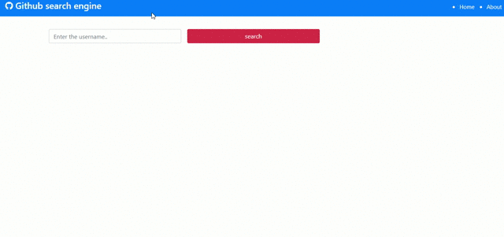
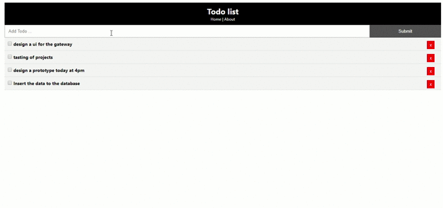
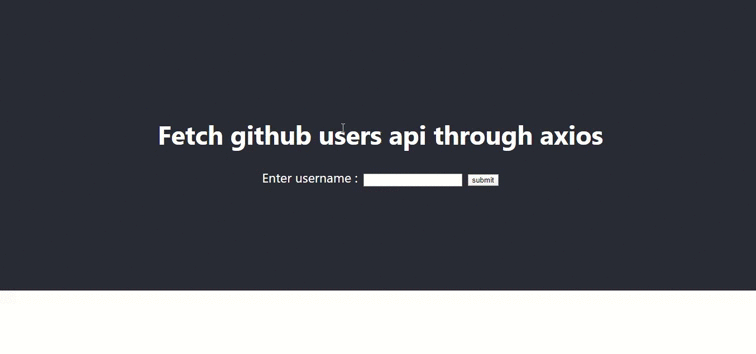

### ES6-React

**Install Typescript**

> $ npm install typescript -g

> $ tsc --init

**Install the latest version of npm module**

> $ npm install npm@latest -g

**Clean Cache**
> $ npm cache clean --force

**React Script**
> $ npm install react-scripts@latest

**React Dom**
> $ npm install --save react-dom

**Create a React App using npm**

> $ npm install -g create-react-app

> $ create-react-app first_app

**Create a React App using npx**

> $ npx create-react-app first_app

**Install bootstrap**

> $ npm i bootstrap@4.1.1

**This will create a production build of your app in the build/ folder of your project**

> $ npm run build

**Install Extension :** [React Extension](https://chrome.google.com/webstore/detail/react-developer-tools/fmkadmapgofadopljbjfkapdkoienihi
"React")

**For the most efficient Brunch production build, install the terser-brunch plugin:**

> $ npm install --save-dev terser-brunch

**For the most efficient Browserify production build, install a few plugins**

> $ npm install --save-dev envify terser uglifyify 

**How to use production build :** [React docs](https://reactjs.org/docs/optimizing-performance.html#use-the-production-build
"React docs")

**Component Lifecycle Methods**

* **componentWillMount** : Immediately before initial rendering 
* **componentDidMount**  : Immediately before after rendering (this will call only one time) 
* **componentWilUpdate** : Before rendering , after receiving new props or state
* **componentDidUpdate** : After component updates are flushed to DOM 

### `npm start`

Runs the app in the development mode. 
Open [http://localhost:3000](http://localhost:3000) to view it in the browser.

<h3 align="center">
<b><a> Developed with :heart: by <a href= "https://hritik5102.github.io/" > Hritik Jaiswal</a>
</b></h3>

**Github Search Engine**

    

  

**To do list**

    

**Fetch github api**

    

